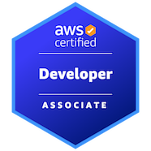

<h1 align="center">Hi 👋, I'm Sounak.</h1>
<h3 align="center">Data Engineer | AWS | Databricks | PySpark | SQL | ETL Automation</h3>

  
  
  

  

  <h3>About Me:</h3>
  <ul>
    <li>Data Engineer designing and deploying scalable ETL pipelines, automating data workflows, and building reliable
      cloud-based data systems with a major focus on improvement of data accessibility, consistency, and performance
      accross platforms.</li>
    <li>Key expertise in <b>Python, SQL, Pyspark and Delta Lake</b>.</li>
    <li>Indepth knowhow of Databricks, AWS Services like <b>Glue, Lambda, Redshift, Athena and S3</b> to use end-to-end
      data engineering solution with these skills transferrable to Azure ecosystem (<b>ADF, Azure SQL, AppFunctions,
        ADLS</b> etc.)</li>
    <li>Proficient in:
      <ul>
        <li>Data Ingestion</li>
        <li>Data Aggregation</li>
        <li>Data Transformation</li>
        <li>Data Pre-processing</li>
        <li>Supervised and unsupervised machine learning techniques</li>
        <li>Data Validation</li>
      </ul>
    </li>
    <li>Implemented end-to-end data monitoring and transformation ETL Pipeline in <b>medallion</b> architecture and
      metadata driven pipeline streamlining ingestion, transformations, and validation across multiple data sources.
    </li>
    <li>Experienced in integrating data pipelines with BI Tools to enable faster decision-making and improve data
      visibility.</li>
    <li>Involved in data governance, lineage tracking and monitoring to ensure the parity in data quality and
      operational reliability.</li>
    <li>Experience in <b>creating CI/CD workflows and pipelines</b> using <b>Azure DevOps</b> and <b>Github Actions</b>.
    </li>
    <li>I am currently exploring frameworks like <b>Apache Airflow, dbt, Great Expectations </b>and<b> Apache
        Iceberg</b> to diversify my personal toolkit.</li>
    <li>I am also exploring the Infrastructure as a code paradigm and DevOps in using <b>Jenkins</b> and
      <b>Terraform</b></li>
    <li>I am an AWS certified Associate for <b>Developer</b> and <b>Data Engineer</b>
    <li>I am also <b>Microsoft Certified</b> in <b>Azure Fundamentals</b>.</li>
  </ul>

<h3 align="left">💻 Machine Configuration: </h3>

  
  
  
  

<h3 align="left">Connect with me:</h3>

  <!--  -->
  
  

 

<h3 align="left">Programming Languages:</h3>

  
  
  
  
  

<h3 align="left">Tools and Frameworks</h3>

  
  
  
  
  
  
  
  
  
  
  
  
  
  
  
  

<h3 align="left">Databases</h3>

  
  
  
  

  <h3 align="left">Cloud Platforms</h3>
  

    
    
    
    
    
  

  <!-- 

 -->
